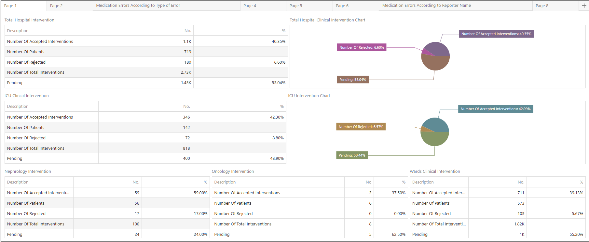

# Clinical Intervention Dashboard

A **Clinical Intervention Dashboard** built with **DevExpress** and **SQL Server**.  
This project provides an interactive interface for monitoring and analyzing clinical intervention data, helping healthcare teams track key metrics, visualize trends, and generate actionable insights for better patient care and operational efficiency.

## 🚀 Technologies Used
- **DevExpress** – Rich, responsive UI components and advanced data visualization
- **SQL Server** – Reliable data storage, management, and querying

